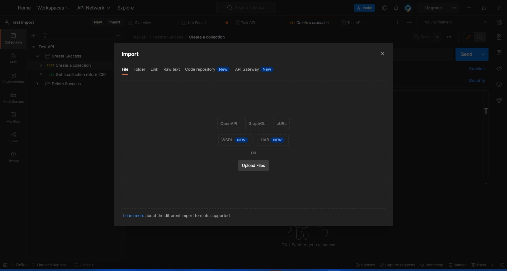
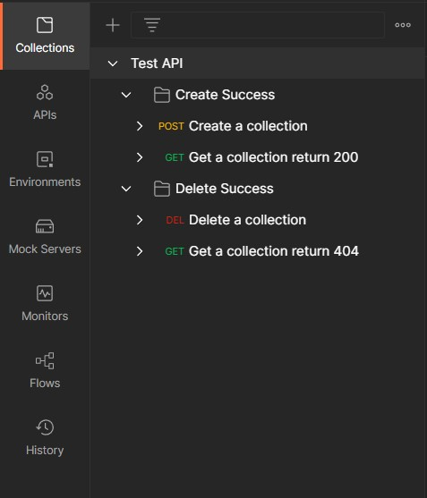
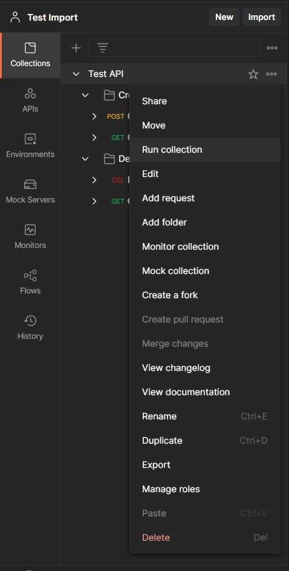
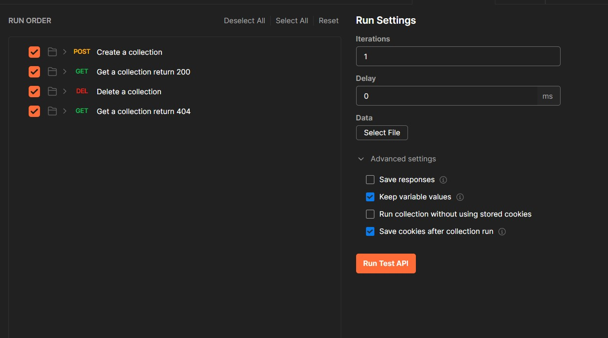
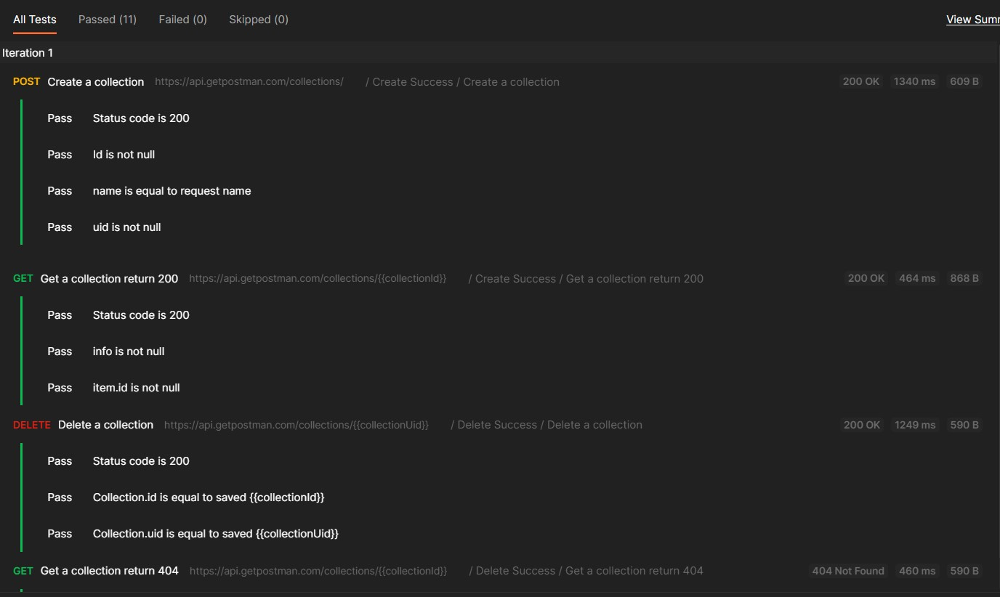
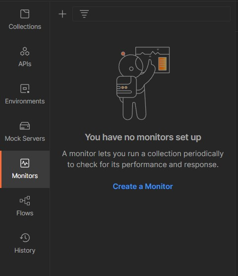
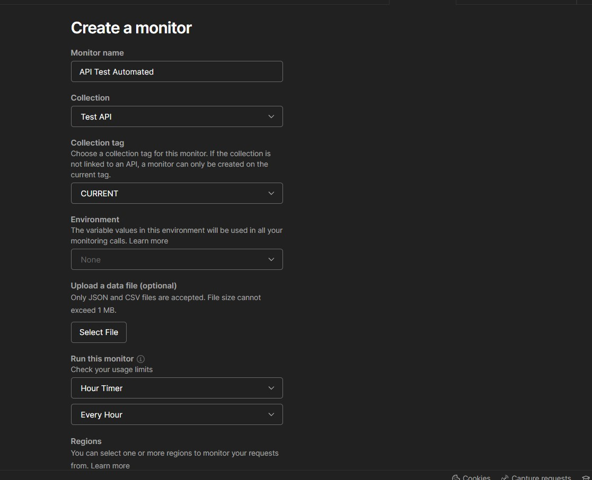
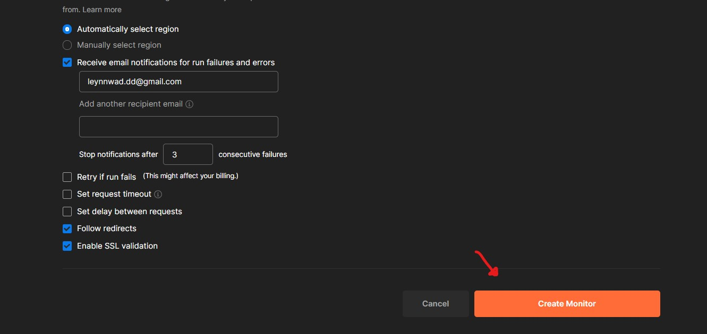
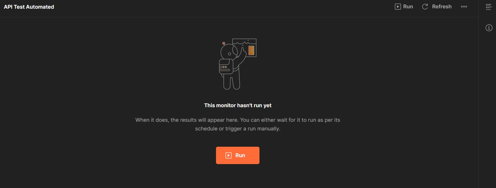
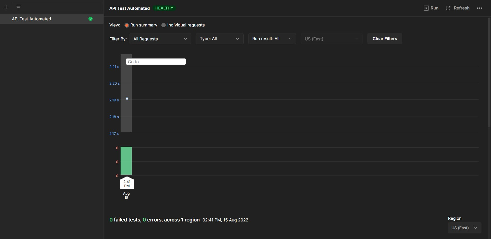

# Automated testing : API

## Setup

1. Download 2 files: `Test API.postman_collection.json` and `workspace.postman_globals.json`

2. There are 2 scenario collections:
    - **Create Success** contains the following APIs:
      - `Post` Create a collection
      - `Get` Get a collection to check if it has created the new collection
    - **Delete Success** contains the following APIs:
      - `Delete` Delete a collection
      - `Get` Get a collection to check if it has removed the target collection

3. You can run entire collection by clicking on three dots at the right of Test API bar and select run collection

4. Click Run Test API button

5. See the testing result

6. You can see the automated testing result with Monitor by clicking `Monitors` at menu bar and click Create a Monitor

7. Set monitor name, select collection as Test API, select the  time and click Create Monitor button 

8. Click Run monitor for the first time

9. Appreciate with the result

